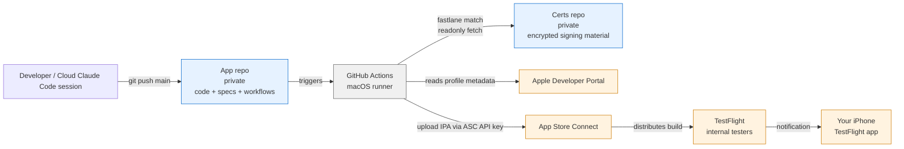

# Shipping iOS to TestFlight from GitHub Actions

**What this is.** A complete, opinionated, solo-developer-friendly pattern for shipping iOS apps to TestFlight from GitHub Actions — no local Mac needed for the build, no Xcode project open on your desktop. Every push to `main` produces a signed build on your phone. **Part 2** covers an optional cost optimization: route CI to your own Mac when it's available, with automatic fallback to GitHub-hosted runners when it isn't.

**Last verified end-to-end in April 2026** against macos-26, Xcode 26.4, Apple's 2026 SDK floor, and current Fastlane. Versions move; the shape of the pattern doesn't.

---

## Table of contents

**Part 1 — Set up the pipeline**

1. [When this pattern fits (and when it doesn't)](#when-this-pattern-fits-and-when-it-doesnt)
2. [Prerequisites](#prerequisites)
3. [Architecture](#architecture)
4. [The two-repo split and why](#the-two-repo-split-and-why)
5. [Runner and Xcode version pinning](#runner-and-xcode-version-pinning)
6. [GitHub Actions environment + secrets](#github-actions-environment--secrets)
7. [Fastlane configuration (three files)](#fastlane-configuration-three-files)
8. [Workflow files](#workflow-files-three-patterns)
9. [Xcode project settings](#xcode-project-settings)
10. [Gotchas — real errors you will hit, with fixes](#gotchas--real-errors-you-will-hit-with-fixes)
11. [Cost](#cost)

**Part 2 — Optional: cut runner cost with a self-hosted Mac**

12. [When this is worth doing](#when-this-is-worth-doing)
13. [Mac prerequisites](#mac-prerequisites)
14. [Runner setup (one-time)](#runner-setup-one-time)
15. [Dynamic chooser pattern](#dynamic-chooser-pattern)
16. [Runner-status token](#runner-status-token)
17. [Why not a third-party fallback action?](#why-not-a-third-party-fallback-action)
18. [Decisions log](#decisions-log)
19. [Mid-flight failure recovery](#mid-flight-failure-recovery)
20. [Edge cases / risks](#edge-cases--risks)
21. [Maintenance & cost tracking](#maintenance--cost-tracking)
22. [When to revisit](#when-to-revisit)

**Appendix**

23. [Multi-app pattern](#multi-app-pattern)
24. [Rotation and security](#rotation-and-security)
25. [Extension points](#extension-points)
26. [References](#references)

---

# Part 1 — Set up the pipeline

## When this pattern fits (and when it doesn't)

**Fits:**
- Solo developer or small team where signing material doesn't need per-developer issuance
- Cloud-first development (Claude Code on the web, Codespaces, GitHub browser UI) — you want to be able to ship a change from any device with a browser
- One or more Apple-platform apps under a single Apple Developer Team
- You want `git push` to main to mean "ship" — no manual Xcode archive dance
- You tolerate ~2–3 minutes of cold-start latency per build (macOS runner spin-up)

**Does not fit as well:**
- Large teams (20+ engineers) where per-developer provisioning profiles and cert-issuance flows matter — look at GitHub Apps + OIDC + ephemeral credentials
- Enterprise distribution (in-house apps) — different cert type, different flow
- Apps with heavy native dependencies that require per-architecture matrix builds — this pattern assumes one build per push
- Strictly regulated environments that require SLSA L3+ provenance — the extension points section covers how to layer that on, but this core pattern is SLSA L1 out of the box

If the pattern fits, the rest of this doc tells you exactly how to set it up.

---

## Prerequisites

Before any of the rest works you need:

1. **Apple Developer Program membership** — $99/year. Sign up at [developer.apple.com](https://developer.apple.com/programs/). Takes 24–72 hours to activate after payment.
2. **Two GitHub repositories** — both private. One for the app ("app repo"), one for encrypted signing material ("certs repo"). If you're starting fresh, create both empty.
3. **Two Apple IDs (common pattern, not required)** — many developers have one Apple ID for their Developer Program + App Store Connect administration, and a different Apple ID on their personal iPhone. TestFlight on the phone uses the phone's Apple ID. The consumer Apple ID must be invited to the Developer Team as a user and then added as an internal tester. You can use a single Apple ID for both, but the two-ID pattern is common for privacy reasons.
4. **A bundle identifier in mind** — reverse-DNS format (e.g., `com.yourname.appname`). Convention: use a domain you own. Avoid the legal-name tax if you care about privacy.
5. **`gh` CLI** installed locally (Homebrew: `brew install gh`) + authenticated (`gh auth login`). The whole pattern is executable from the command line; `gh` is how you set secrets, open PRs, and trigger workflows.

Allow ~60 minutes for initial setup plus the Apple activation wait.

---

## Architecture



Key properties of this topology:

- **No direct path from the developer's machine to Apple.** All Apple-side writes (cert generation, build upload, TestFlight publish) flow through the GitHub runner.
- **Signing material is encrypted at rest.** The certs repo stores AES-encrypted blobs (Fastlane Match), decrypted only during a build job on a short-lived runner with an ephemeral keychain.
- **One developer key chain (SSH deploy key) links the runner to the certs repo** — scoped to one repo, read-write, revocable.
- **One App Store Connect API key** authenticates Apple-side operations — team-scoped, auto-rotated, minimal-privilege role (App Manager, not Admin).

---

## The two-repo split and why

Beginners often ask why certs aren't stored in the app repo directly. Four reasons for the split:

1. **Multi-app reuse.** A single Apple Developer Team has one iOS Distribution certificate. Every app under that team signs with the same cert. Storing certs in one app's repo means that when you ship app #2, you either duplicate certs or you couple both apps' signing to one app's repo. A dedicated certs repo scales naturally — it grows one `.mobileprovision` per bundle ID, one shared cert for all.
2. **Rotation boundary.** Rotating the Match encryption password means wiping and regenerating the certs repo. Doing that on a repo that also holds app source is tedious (branches, history, merge conflicts). A dedicated cert-only repo can be nuked and regenerated cleanly.
3. **Principle of least privilege.** The deploy key that reads+writes the certs repo should not have access to app source. And the GitHub token that opens PRs on app source should not have access to signing material. Separating the repos lets you grant each credential exactly what it needs.
4. **Blast radius on compromise.** If the app repo's deploy key leaks, certs are untouched. If the certs repo's deploy key leaks, no app source is exposed. Smaller blast radius per credential.

**Naming convention**: the certs repo is generic, not app-specific. A name like `apple-match-certs` or `ios-match-certs` works because a single repo serves many apps. Avoid `myapp-certs` — you'll regret it when you ship app #2.

---

## Runner and Xcode version pinning

Pin runner image and Xcode version explicitly. Never rely on `macos-latest` in a deployable workflow.

**As of April 2026:**
- Runner image: `macos-26` (Apple's year-based versioning post–WWDC 2025; macos-15 is the prior stable; macos-latest still points to 15 but will flip to 26)
- Xcode: `26.4` (default on macos-26 is 26.2; multiple versions available; pin explicitly)
- Apple's upload floor: Xcode 26 + iOS 26 SDK required for all App Store and TestFlight uploads since 2026-04-28

**Workflow snippet:**
```yaml
runs-on: macos-26
steps:
  - uses: actions/checkout@<full-sha>      # v6.x
  - uses: maxim-lobanov/setup-xcode@<full-sha>   # v1.7+
    with:
      xcode-version: '26.4'
```

**Why pin to a specific Xcode version rather than "latest stable":**
- Predictable builds. A new Xcode release can change SDK behavior, warning-to-error promotion, and code signing. You want to decide when to bump, not have it happen on a random Tuesday.
- If you ever need to roll back after a bad release, explicit pin makes that a one-line change.

**Why SHA-pin every third-party action:**
- In March 2025, the popular `tj-actions/changed-files` action was compromised; attackers pushed payloads to many tags simultaneously, exfiltrating secrets from tens of thousands of workflows in the 12 hours before detection. Tags are mutable; SHAs are not. Every action in your workflow should reference a full 40-character commit SHA, with an inline `# vX.Y.Z` comment on the same line (Dependabot auto-updates that comment when it bumps the SHA — standalone header comments don't get maintained).

**Finding an action's commit SHA:**
```bash
gh api /repos/OWNER/REPO/git/refs/tags/TAG --jq '.object.sha'
# If .object.type is "tag" (annotated tag), dereference:
gh api /repos/OWNER/REPO/git/tags/<returned-sha> --jq '.object.sha'
```

---

## GitHub Actions environment + secrets

Use a dedicated Actions environment for deploys. The environment gives you:

- A branch-restriction policy (only `main` can trigger jobs that use this environment)
- A scope boundary for secrets that only the deploy path should see
- An audit trail of deploys separate from general workflow runs

**Name the environment `testflight`** (or `production` if you prefer that idiom). Restrict it to the `main` branch in Settings → Environments → Deployment branches → Selected branches → `main`.

**Secret split — repo vs environment:**

| Level | Secrets | Why |
|---|---|---|
| **Repository secrets** (visible to every workflow on the repo) | `MATCH_DEPLOY_KEY`, `MATCH_PASSWORD`, `MATCH_GIT_URL` | Match operations may run on non-deployment workflows too (e.g., cert rotation, smoke tests). Repo-level is the right scope. |
| **Environment secrets** on `testflight` (only workflows with `environment: testflight` can read them) | `ASC_KEY_ID`, `ASC_ISSUER_ID`, `ASC_PRIVATE_KEY_B64` | These credentials authenticate the upload path to Apple. Keep them behind the environment boundary so only deploy workflows (running from `main`) can access them. |

**Naming conventions explained:**
- `MATCH_DEPLOY_KEY` — the private half of an SSH deploy key added to the certs repo with write access. Named "deploy key" rather than the fastlane-default `MATCH_GIT_PRIVATE_KEY` because fastlane's env var of that name expects a *path* to the key; we load ours into ssh-agent via `webfactory/ssh-agent` and the secret holds the raw key contents.
- `MATCH_PASSWORD` — the AES passphrase Fastlane Match uses to encrypt/decrypt the certs. Also store a copy in a password manager. Losing this means every cert in the certs repo becomes unrecoverable.
- `MATCH_GIT_URL` — SSH URL of the certs repo. Not secret per se (public knowledge if someone asks), but keeping it as a secret centralizes "where do certs live" to one rotatable spot.
- `ASC_KEY_ID` — 10-char ID of your App Store Connect API key.
- `ASC_ISSUER_ID` — UUID identifying your team to ASC. One per Developer Team.
- `ASC_PRIVATE_KEY_B64` — base64-encoded `.p8` content. Apple only lets you download the `.p8` once; base64 it immediately and feed it into `gh secret set` via stdin so it never lives in a shell history or chat transcript.

**Setting secrets via CLI (so the `.p8` never passes through anything you type):**
```bash
# Repo-level
echo "<KEY_ID>" | gh secret set ASC_KEY_ID --repo OWNER/APPREPO --env testflight
echo "<ISSUER_ID>" | gh secret set ASC_ISSUER_ID --repo OWNER/APPREPO --env testflight
base64 -i ~/Downloads/AuthKey_XXXXXXXXXX.p8 | gh secret set ASC_PRIVATE_KEY_B64 --repo OWNER/APPREPO --env testflight

# Verify
gh api /repos/OWNER/APPREPO/environments/testflight/secrets --jq '.secrets[].name'
```

---

## Fastlane configuration (three files)

Fastlane is the workhorse. You need three files in a `fastlane/` directory in your app repo.

### `fastlane/Matchfile`

Match's configuration. Points at the certs repo, declares the bundle ID(s) you want to manage, pins the git branch.

```ruby
git_url("git@github.com:OWNER/apple-match-certs.git")
git_branch("main")
storage_mode("git")

type("appstore")
app_identifier(["com.yourname.appname"])
team_id("YOURTEAMID")
```

**Why `git_branch("main")` explicit:** fastlane match defaults to `master` branch (legacy). Modern GitHub repos default to `main`. Without the explicit pin, match will happily create a `master` branch on your certs repo and push there, orphaning `main`. Always specify.

**Why `app_identifier` is an array:** you can list multiple bundle IDs here if one repo manages multiple apps' signing. For a single-app repo, the single-element array is fine.

### `fastlane/Appfile`

Per-app identity info. Minimal when using API key auth (which you should):

```ruby
app_identifier("com.yourname.appname")
team_id("YOURTEAMID")
```

**What's NOT here:** no `apple_id` field. The `apple_id` field is used by fastlane's Spaceship for interactive authentication — which you don't need because you authenticate with the ASC API key. Leaving `apple_id` unset is intentional; it avoids stale-config drift if your Apple account email changes.

### `fastlane/Fastfile`

The executable part. Define three lanes:

```ruby
default_platform(:ios)

platform :ios do
  before_all do
    setup_ci if ENV["CI"]
  end

  desc "One-shot: generate iOS Distribution cert + appstore provisioning profile, push encrypted to certs repo. workflow_dispatch only."
  lane :bootstrap_certificates do
    asc_api_key
    match(
      type: "appstore",
      readonly: false,
      force_for_new_devices: false,
      verbose: true
    )
  end

  desc "Fetch existing certs readonly (used by deploy)."
  lane :fetch_certificates do
    match(type: "appstore", readonly: true)
  end

  desc "Build → archive → sign → upload to TestFlight. Triggered on push to main."
  lane :build_and_upload do
    key = asc_api_key
    fetch_certificates

    current_version = get_version_number(
      xcodeproj: "YourApp.xcodeproj",
      target: "YourApp"
    )
    latest_build = latest_testflight_build_number(
      version: current_version,
      api_key: key,
      initial_build_number: 0
    )
    increment_build_number(
      build_number: latest_build + 1,
      xcodeproj: "YourApp.xcodeproj"
    )

    build_app(
      scheme: "YourApp",
      export_method: "app-store",
      clean: true,
      output_directory: "build",
      output_name: "YourApp.ipa",
      export_options: {
        provisioningProfiles: {
          "com.yourname.appname" => "match AppStore com.yourname.appname"
        }
      }
    )

    upload_to_testflight(
      api_key: key,
      skip_waiting_for_build_processing: true,
      distribute_external: false
    )
  end

  private_lane :asc_api_key do
    app_store_connect_api_key(
      key_id: ENV.fetch("ASC_KEY_ID"),
      issuer_id: ENV.fetch("ASC_ISSUER_ID"),
      key_content: ENV.fetch("ASC_PRIVATE_KEY_B64"),
      is_key_content_base64: true,
      in_house: false
    )
  end
end
```

**Design notes:**

- The three lanes correspond to three lifecycle moments: initial cert generation (run once at project bootstrap + again on cert rotation), normal reads during deploys, and the deploy itself.
- `setup_ci` creates an ephemeral keychain that's destroyed when the runner tears down. No signing material persists.
- `increment_build_number` reads the latest TestFlight build number via the API key and bumps it by one. This produces monotonic build numbers across branches and retries without collisions.
- `provisioningProfiles` map in `export_options` tells `build_app` exactly which profile to use — Match names them `match AppStore <bundle-id>`.
- `skip_waiting_for_build_processing: true` returns as soon as upload completes; Apple-side processing (5–20 min) happens asynchronously. Don't block the runner waiting.
- `distribute_external: false` keeps the build in internal testing only. External TestFlight distribution triggers Apple Review, which you don't want during iteration.

**Gemfile pinning:**

```ruby
source "https://rubygems.org"
gem "fastlane"

plugins_path = File.join(File.dirname(__FILE__), "fastlane", "Pluginfile")
eval_gemfile(plugins_path) if File.exist?(plugins_path)
```

Commit the `Gemfile.lock` so CI and local use the same fastlane version. Regenerate with `bundle install` when you want to bump. If your local Ruby version is significantly older than CI's (see Gotchas), use `brew install ruby@3.3` to get a modern local Ruby.

---

## Workflow files (three patterns)

Three `.github/workflows/*.yml` files cover the full lifecycle.

### `deploy.yml` — steady-state

Lives permanently in the repo. Runs on every push to `main`.

```yaml
name: Deploy to TestFlight

on:
  push:
    branches: [main]
  workflow_dispatch:

concurrency:
  group: deploy
  cancel-in-progress: false

jobs:
  deploy:
    name: Build + upload to TestFlight
    runs-on: macos-26
    environment: testflight
    timeout-minutes: 30
    steps:
      - uses: actions/checkout@<SHA> # v6.0.2
      - uses: maxim-lobanov/setup-xcode@<SHA> # v1.7.0
        with:
          xcode-version: '26.4'
      - uses: ruby/setup-ruby@<SHA> # v1.302.0
        with:
          ruby-version: "3.3"
          bundler-cache: true
      - uses: webfactory/ssh-agent@<SHA> # v0.10.0
        with:
          ssh-private-key: ${{ secrets.MATCH_DEPLOY_KEY }}
      - name: Trust GitHub SSH host key
        run: |
          mkdir -p ~/.ssh
          ssh-keyscan github.com >> ~/.ssh/known_hosts 2>/dev/null
      - name: Build + upload
        env:
          MATCH_PASSWORD: ${{ secrets.MATCH_PASSWORD }}
          MATCH_GIT_URL: ${{ secrets.MATCH_GIT_URL }}
          ASC_KEY_ID: ${{ secrets.ASC_KEY_ID }}
          ASC_ISSUER_ID: ${{ secrets.ASC_ISSUER_ID }}
          ASC_PRIVATE_KEY_B64: ${{ secrets.ASC_PRIVATE_KEY_B64 }}
        run: bundle exec fastlane build_and_upload
```

**Concurrency settings explained:** `group: deploy, cancel-in-progress: false` means if two pushes to main arrive within 2 minutes, the second waits in line rather than preempting the first. Never drop a deploy mid-flight — you want every commit that hits main to eventually reach TestFlight.

### `bootstrap-certs.yml` — disposable one-shot

Lives in the repo *only* during project bootstrap (or when certs expire / password rotates). Delete after a single green run.

```yaml
name: Bootstrap Certificates

on:
  workflow_dispatch:

concurrency:
  group: bootstrap-certs
  cancel-in-progress: false

jobs:
  bootstrap:
    name: Generate + store certs
    runs-on: macos-26
    environment: testflight
    timeout-minutes: 15
    steps:
      # ... same setup steps as deploy.yml ...
      - name: Generate + push encrypted certs via Match
        env:
          MATCH_PASSWORD: ${{ secrets.MATCH_PASSWORD }}
          MATCH_GIT_URL: ${{ secrets.MATCH_GIT_URL }}
          ASC_KEY_ID: ${{ secrets.ASC_KEY_ID }}
          ASC_ISSUER_ID: ${{ secrets.ASC_ISSUER_ID }}
          ASC_PRIVATE_KEY_B64: ${{ secrets.ASC_PRIVATE_KEY_B64 }}
        run: bundle exec fastlane bootstrap_certificates
```

**Why it's disposable:** in steady state, the only way to generate certs is manually, by a human who knows what they're doing. Leaving a `workflow_dispatch` + `readonly: false` workflow permanently in the repo is an unnecessary footgun — any collaborator with access to Actions could accidentally regenerate certs and invalidate all existing builds. Delete after the bootstrap succeeds; recover from git history when you need to rotate or add a new app.

**Recovery when needed:**
```bash
# Find the commit that last had bootstrap-certs.yml
git log --oneline --all -- .github/workflows/bootstrap-certs.yml | head -1
# Restore from that commit into a new chore branch
git show <sha>:.github/workflows/bootstrap-certs.yml > .github/workflows/bootstrap-certs.yml
# Run, then delete again
```

### `credential-check.yml` — disposable smoke test

Optional but recommended for first-time setup. Validates the Match + ASC credential chain end-to-end without doing a real build. Also disposable — delete after one green run.

```yaml
name: Credential check

on:
  workflow_dispatch:

jobs:
  check:
    runs-on: macos-26
    environment: testflight
    steps:
      # ... setup steps ...
      - name: Fetch certs via Match (readonly)
        env:
          MATCH_PASSWORD: ${{ secrets.MATCH_PASSWORD }}
          MATCH_GIT_URL: ${{ secrets.MATCH_GIT_URL }}
        run: |
          bundle exec fastlane run match type:appstore readonly:true \
            git_url:"$MATCH_GIT_URL" storage_mode:git
          echo "::notice::Match readonly fetch succeeded"
      - name: Decode ASC API key to ephemeral file
        env:
          ASC_PRIVATE_KEY_B64: ${{ secrets.ASC_PRIVATE_KEY_B64 }}
        run: |
          mkdir -p "$RUNNER_TEMP/asc"
          echo "$ASC_PRIVATE_KEY_B64" | base64 --decode > "$RUNNER_TEMP/asc/AuthKey.p8"
          chmod 600 "$RUNNER_TEMP/asc/AuthKey.p8"
          echo "ASC_KEY_PATH=$RUNNER_TEMP/asc/AuthKey.p8" >> $GITHUB_ENV
      - name: Authenticate to App Store Connect (auth only, no upload)
        env:
          ASC_KEY_ID: ${{ secrets.ASC_KEY_ID }}
          ASC_ISSUER_ID: ${{ secrets.ASC_ISSUER_ID }}
        run: |
          bundle exec fastlane run app_store_connect_api_key \
            key_id:"$ASC_KEY_ID" issuer_id:"$ASC_ISSUER_ID" \
            key_filepath:"$ASC_KEY_PATH" in_house:false
          echo "::notice::ASC API key loaded — credential chain validated"
      - name: Clean up
        if: always()
        run: rm -f "$RUNNER_TEMP/asc/AuthKey.p8"
```

**Value:** decouples "can we sign?" from "can we build?" If this passes, you know the credentials are wired correctly. If your next deploy fails, it's a build problem, not a signing problem. Without this step, a failed first deploy could be either — and diagnosing a 15-minute build job is expensive.

### Optional: agent-readable CI failures (`pr-test.yml`)

The deploy-on-push-to-main pattern above can be paired with a PR-level test gate that catches failures *before* merge. The non-obvious shape is the **failure comment**: a structured PR comment posted on every red `xcodebuild test` run, designed so a GitHub-API consumer (CI bot, LLM-driven agent, Slackbot) can pull the relevant lines without humans copy-pasting from the Actions UI. The pattern is a `### ❌` header (greppable), a `grep`-extracted **failure-marker block** open by default (every line matching Swift compile/test failure patterns + 4 lines of trailing context), and a **30 KB log tail** collapsed as the fallback for shapes the grep didn't catch. The grep extract surfaces the failing `file:line:symbol` regardless of where in the alphabet the failing suite ran; the 30 KB ceiling fits most failures while staying inside an LLM's token budget; a comment is a first-class GitHub object exposed via `GET /repos/:owner/:repo/issues/:number/comments`, whereas check-run output fields are variably populated for raw `xcodebuild` failures.

```yaml
# .github/workflows/pr-test.yml — failure-summary step (excerpt)
- name: Run tests
  run: |
    set -o pipefail
    xcodebuild test \
      -project YourApp.xcodeproj -scheme YourApp \
      -destination 'platform=iOS Simulator,name=iPhone 17,OS=latest' \
      -skipMacroValidation \
      | tee build.log

- name: Post failure summary as PR comment
  if: failure() && github.event_name == 'pull_request'
  uses: actions/github-script@<SHA> # v9.x
  env:
    LOG_PATH: build.log
  with:
    script: |
      const fs = require('fs');
      const log = fs.readFileSync(process.env.LOG_PATH, 'utf8');

      // Tune the regex to your test framework / language
      const markers = /(\.swift:\d+:\d+:\s*error:|Test Case .* failed|\*\* (TEST|BUILD) FAILED \*\*|XCTAssert\w* failed|Fatal error:)/;
      const lines = log.split('\n');
      const extract = [];
      for (let i = 0; i < lines.length; i++) {
        if (markers.test(lines[i])) {
          extract.push(...lines.slice(i, Math.min(i + 5, lines.length)));
          extract.push('---');
        }
      }
      const tail = log.slice(-30000);

      const body = [
        '### ❌ `xcodebuild test` failed',
        '',
        '<details open><summary>Failure-marker extract</summary>',
        '',
        '```',
        extract.join('\n') || '(no failure markers matched — see tail below)',
        '```',
        '',
        '</details>',
        '',
        '<details><summary>Last ~30 KB tail</summary>',
        '',
        '```',
        tail,
        '```',
        '',
        '</details>',
      ].join('\n');

      await github.rest.issues.createComment({
        owner: context.repo.owner,
        repo: context.repo.repo,
        issue_number: context.issue.number,
        body
      });
```

**Footgun if you pair this with a [repository ruleset](https://docs.github.com/en/repositories/configuring-branches-and-merges-in-your-repository/managing-rulesets/about-rulesets):** a workflow whose check is in the ruleset's required-checks list must run on **every** PR — no `paths-ignore`, no job-level `if:` that early-exits. A path-skipped required check reports as **missing** to the ruleset (not passing), and the merge is blocked even by `gh pr merge --admin`. Either the workflow runs every PR, or the check comes out of the required list.

### Dependabot for action pin maintenance

Drop a `.github/dependabot.yml` so Dependabot opens PRs when any pinned action publishes a new release. It also bumps the `# vX.Y.Z` inline comment if you use the recommended SHA + comment format.

```yaml
version: 2
updates:
  - package-ecosystem: github-actions
    directory: "/"
    schedule:
      interval: weekly
      day: monday
      time: "03:00"
    allow:
      - dependency-type: direct
  - package-ecosystem: bundler
    directory: "/"
    schedule:
      interval: weekly
```

---

## Xcode project settings

A few Xcode project settings are non-obvious and critical:

**Code signing (manual, not automatic):**
- `CODE_SIGN_STYLE = Manual`
- `CODE_SIGN_IDENTITY = "Apple Distribution"` (not "iPhone Distribution", which is the older name)
- `DEVELOPMENT_TEAM = YOURTEAMID`
- `PROVISIONING_PROFILE_SPECIFIER = "match AppStore com.yourname.appname"` — the literal name Fastlane Match uses for AppStore-type profiles

Automatic signing won't work in CI because it requires interactive Xcode session access to your Apple ID. Manual signing + Match = the only combination that runs unattended.

**Info.plist generation (synthesized, not a file):**
- `GENERATE_INFOPLIST_FILE = YES` — Xcode synthesizes `Info.plist` from build settings
- `INFOPLIST_KEY_CFBundleIconName = AppIcon` — required for all App Store uploads since iOS 11; omitting this means altool rejects with error `90713`
- `INFOPLIST_KEY_ITSAppUsesNonExemptEncryption = NO` — auto-answers Apple's "does your app use encryption?" question. `NO` is correct for any app that only uses HTTPS via URLSession (HTTPS is explicitly exempt). Setting this avoids the "Missing Compliance" badge on every TestFlight build. Set to `YES` only if you implement custom encryption algorithms.
- `INFOPLIST_KEY_UILaunchScreen_Generation = YES` — lets Xcode generate a bare launch screen; without it, older devices may reject the app
- `INFOPLIST_KEY_UIApplicationSceneManifest_Generation = YES` — generates scene manifest for iPadOS/multi-window (harmless for iPhone-only apps)

**Deployment target and device family:**
- `IPHONEOS_DEPLOYMENT_TARGET = 17.0` (or whatever minimum you're targeting)
- `TARGETED_DEVICE_FAMILY = 1` for iPhone only; `1,2` for iPad support too

**Asset catalog:**
- Your `Assets.xcassets` must contain an `AppIcon.appiconset` with at least a 1024×1024 PNG for App Store listing. Omitting this means altool error `90022`. A single `1024x1024.png` in the asset catalog covers all size variants via automatic scaling.

**Preview assets:**
- `DEVELOPMENT_ASSET_PATHS = "\"AppName/Preview Content\""` if you use SwiftUI preview assets; points at the folder (note the escaped quotes).

---

## Gotchas — real errors you will hit, with fixes

Every gotcha below is real. Each was earned during initial pipeline setup; knowing them up front saves hours.

### 1. `match` defaults to the `master` branch

**Symptom:** First bootstrap runs successfully, workflow is green, but when you look at the certs repo's default branch (`main`), there are no certs. A `master` branch has been created with everything in it.

**Cause:** fastlane match has a legacy default of `master` for its `git_branch` setting. Modern GitHub repos default to `main`.

**Fix:** add `git_branch("main")` to your Matchfile. If you've already hit this, migrate the files from master to main (copy via git checkout, PR to main, delete master).

### 2. Local Ruby version incompatibility

**Symptom:** `bundle install` runs fine locally, but the committed Gemfile.lock causes CI to fail at the bundler step with obscure errors like `String#untaint is undefined` or `CFPropertyList 3.0.9 requires ruby version < 3.2`.

**Cause:** macOS ships a very old Ruby (2.6). A `Gemfile.lock` generated there pins old Bundler and old gem versions that aren't compatible with modern Ruby (3.2+) in CI.

**Fix:** install Ruby 3.3 locally via Homebrew (`brew install ruby@3.3`; ruby@3.3 is keg-only, so add `export PATH="/opt/homebrew/opt/ruby@3.3/bin:$PATH"` to your `~/.zshrc`), then regenerate the lock. If you can't upgrade local Ruby, alternatives: don't commit `Gemfile.lock` (CI resolves fresh each run, ~15s overhead, loses reproducibility) or regenerate the lock on a CI run and commit the artifact back.

### 3. altool rejects upload — error 90022 (missing icon)

**Symptom:** `xcodebuild archive` succeeds, IPA is signed correctly, but `upload_to_testflight` fails with `The bundle does not contain an app icon for iPhone / iPod Touch of exactly '120x120' pixels, in .png format for iOS versions >= 10.0`.

**Cause:** altool (Apple's upload tool) validates icon content in a way that Xcode's local archive does not. A missing or incorrectly-sized icon passes local archive but fails at upload.

**Fix:** place a 1024×1024 PNG in `AppIcon.appiconset/` and reference it in `Contents.json`. iOS 14+ can generate all smaller sizes from a single 1024×1024. If you don't have an icon design yet, a solid-color placeholder works for TestFlight iteration.

### 4. altool rejects upload — error 90713 (missing `CFBundleIconName`)

**Symptom:** After fixing icon presence, upload still fails with `Missing Info.plist value. A value for the Info.plist key 'CFBundleIconName' is missing in the bundle`.

**Cause:** Apps built with the iOS 11+ SDK must set `CFBundleIconName` in `Info.plist` pointing to the AppIcon set name. Xcode doesn't add this automatically when `GENERATE_INFOPLIST_FILE = YES` unless you tell it to.

**Fix:** add `INFOPLIST_KEY_CFBundleIconName = AppIcon` to your Xcode project's build settings (Debug and Release both).

### 5. "Missing Compliance" badge on every TestFlight build

**Symptom:** Every upload lands in ASC as "Missing Compliance" — you have to click Manage, answer the "Does your app use encryption?" question manually, and save before testers can install.

**Cause:** Apple requires an export compliance answer for every build. Without a declared answer, TestFlight blocks distribution.

**Fix:** for apps that only use HTTPS (which is the vast majority — HTTPS is explicitly exempt from Apple's encryption export rules), add `INFOPLIST_KEY_ITSAppUsesNonExemptEncryption = NO` to your project's build settings. This bakes "No" into the Info.plist at build time and the Manage step disappears. Only set to `YES` if you ship custom encryption algorithms.

### 6. App record must be manually created in App Store Connect

**Symptom:** First `upload_to_testflight` fails with "The provided App ID does not exist" or similar.

**Cause:** Fastlane does not create the ASC app record for you. `deliver init` is a metadata *management* tool, not a creation tool.

**Fix:** manually create the app record in appstoreconnect.apple.com → My Apps → "+" → New App. Requires a bundle ID that's already registered in the Apple Developer Portal (Certificates, Identifiers & Profiles → Identifiers). One-time per app.

### 7. ASC API key needs App Manager role, not Developer

**Symptom:** TestFlight build uploads succeed, but fastlane can't update build metadata, add testers, or distribute builds. Errors reference insufficient permissions.

**Cause:** "Developer" role can create builds but cannot modify TestFlight metadata. "App Manager" is the minimum-privilege role that can.

**Fix:** when generating the ASC API key, choose **App Manager** role. If you already generated a Developer-role key, revoke it and generate a new one.

### 8. Two Apple IDs: Dev account vs TestFlight consumer account

**Symptom:** TestFlight doesn't show new builds on your iPhone, even though ASC shows the build as "Ready to Test".

**Cause:** The Apple ID signed into TestFlight on your phone isn't on the internal tester list for the app.

**Fix:** invite the consumer Apple ID to your Developer Team as a team member (via ASC → Users and Access → Invite User → Developer role). They accept the invite in their email. Then add them to the Internal Testing group in TestFlight. Toggle "Enable automatic distribution" ON so every new build reaches them automatically.

---

## Cost

**Dollar cost:**
- Apple Developer Program: $99 / year (flat, required)
- GitHub Actions macOS runner minutes: included in the 2000 min/month free tier, but macOS minutes are billed at a 10× multiplier against that quota — so effectively 200 macOS-minutes per month on a personal account

**Deploy minute math (April 2026 baseline):**
- Full deploy run (checkout + Xcode select + Ruby + match fetch + build + archive + upload): about 2.5–3 minutes on macos-26
- At 3 min/deploy and 200 min/mo quota: roughly 65 deploys/mo before you start paying
- Beyond the free tier: GitHub charges per-minute. For a solo dev shipping 1–3 builds/day, the free tier is more than enough. For a team shipping 20+ builds/day, budget accordingly.

**Hidden cost:**
- Cold-start latency: ~30–60s for the runner image to provision before your job starts. On macos runners specifically, this is slower than Linux. If you care about minimizing commit-to-TestFlight latency, it's more impactful to optimize the build (caching, avoid clean builds) than to shave seconds off the pipeline itself.

If your iteration pace is going to outgrow that math, **Part 2** covers the optional fix: route CI to your own Mac when it's available, fall back to GitHub-hosted automatically when it isn't.

---

# Part 2 — Optional: cut runner cost with a self-hosted Mac

The pipeline above runs entirely on GitHub-hosted `macos-26` runners. As iteration pace ramps, the macOS-multiplier billing line is what you'll feel first. This part covers an optional optimization: route CI to your own Mac (a MacBook Pro that's already paid for, or a cheap Mac mini) when it's available, with **automatic fallback** to GitHub-hosted runners when it isn't. This isn't "self-hosted only" — that approach dies the moment your home Mac is offline. The pattern below is a tiny Linux preflight job that decides at workflow time which runner to use.

The optimization is genuinely optional. If your current macOS-minute usage stays inside GitHub's free tier, skip Part 2 — the rest of the pipeline serves you fine.

---

## When this is worth doing

GitHub-hosted `macos-26` runners are billed at a higher multiplier than Linux on the Pro plan (verify the exact macOS multiplier and included minutes against `https://github.com/settings/billing` before any hardware purchase — GitHub changes pricing and images over time). At ~30 PR cycles per week of active iteration, the included macOS minutes typically last ~5–7 days; overage thereafter can run on the order of **~$30/week**. Your mileage varies with iteration pace.

Hardware payback math: a M2/M4 Mac mini ($600–800) recoups in ~5–6 months at the rate above. **An existing MacBook Pro is already paid for**, so the marginal cost is electricity + maintenance + the laptop being "busy" while a job runs. That makes self-hosting a clean first move regardless of how the pricing changes — and the chooser pattern means you can revert by deleting one workflow file if it stops fitting.

The shape of the recommended setup:

```
ubuntu chooser job → self-hosted Mac if online + idle → macos-26 if unavailable
```

This gives you "Mac CI when available, GitHub-hosted resilience when not" without needing to flip a switch when the laptop is closed / asleep / on a flaky home network. Start with `pr-test.yml` (if you have one); add `deploy.yml` later if cost demands it.

**Caveat:** this is **preflight fallback, not mid-flight failover**. If the chooser sees the Mac as online/idle, emits self-hosted labels, and *then* the Mac goes offline before the macOS job picks up, the job may queue or fail. That edge case is acceptable for solo development. For truly high-reliability deploys, keep `deploy.yml` on GitHub-hosted (and use this pattern for `pr-test.yml` only).

---

## Mac prerequisites

- **Apple Silicon Mac** (M1 or newer). Intel Macs work but every CI minute is 30–50% slower; not worth the maintenance for marginal savings vs. GitHub-hosted.
- **Xcode** matching the version pinned in your workflow's `xcode-version`. Run `sudo xcode-select -s /Applications/Xcode.app/Contents/Developer` once after install. Verify: `xcodebuild -version` reports the right version.
- **Metal Toolchain** — Xcode 26 split the Metal compiler into a downloadable component that is **not** installed by default. Install once: `sudo xcodebuild -downloadComponent MetalToolchain` (~few hundred MB, prompts for password). Required if any of your dependencies ship hand-written `.metal` shaders. Verify: `xcrun metal --version` returns a version string instead of erroring.
- **Disk:** ~50 GB free. Xcode (~30 GB) + DerivedData + simulator runtimes (~5–10 GB per iOS major version) + GitHub runner work directories add up.
- **Network:** persistent home internet. Wired Ethernet > Wi-Fi for reliability — a job that fails halfway because Wi-Fi flapped is a wasted run.
- **Power:** plugged in. macOS App Nap / sleep policies pause the runner if the lid closes or it's on battery for too long. Either keep the lid open OR use `caffeinate -d` / "Prevent computer from sleeping when display is off" in Energy settings.
- **Ruby 3.3** (matching CI, for `fastlane`): `brew install ruby@3.3` then add `/opt/homebrew/opt/ruby@3.3/bin` to `$PATH`. Verify: `ruby -v` reports `3.3.x`.

---

## Runner setup (one-time)

GitHub's runner application is what polls for jobs and executes them.

### Create the runner in the repo

1. On the repo: **Settings → Actions → Runners → New self-hosted runner**.
2. Pick **macOS** + **ARM64** (matches Apple Silicon).
3. The page gives you a one-time registration token and a sequence of shell commands. Don't close that tab — you'll need the token below.

### Install on the Mac

In a fresh Terminal window on the Mac, follow GitHub's commands literally. They look like this (*don't copy these — use the live token from your GitHub page*):

```bash
mkdir actions-runner && cd actions-runner

# 1. Download the runner. Version moves; use the URL from the GitHub
# Actions Runners page so you get the matching ARM64 build.
curl -o actions-runner-osx-arm64-X.Y.Z.tar.gz \
  -L https://github.com/actions/runner/releases/download/vX.Y.Z/actions-runner-osx-arm64-X.Y.Z.tar.gz

# 2. (Optional but recommended) verify the tarball SHA against the
# release page's "SHA-256" line. Reproducibility / supply-chain hygiene.
shasum -a 256 actions-runner-osx-arm64-X.Y.Z.tar.gz

# 3. Extract.
tar xzf ./actions-runner-osx-arm64-X.Y.Z.tar.gz

# 4. Configure — paste the registration token from the GitHub UI here.
# Accept the defaults for runner name (hostname), runner group (Default),
# work folder (_work). Add labels you'll match in the workflow file.
./config.sh --url https://github.com/<OWNER>/<REPO> --token <YOUR_TOKEN> \
  --labels self-hosted,macOS,ARM64,Xcode26.4
```

The `--labels` matter — your workflow's `runs-on:` line targets these. Defaults already include `self-hosted` + `macOS` + `ARM64`; adding `Xcode26.4` future-proofs against running a Swift 6 / Xcode 27 job on a runner that hasn't been upgraded yet.

### Run as a launchd service so it survives reboots

Without this, the runner only works when the Terminal window is open. Configure it as a launchd service so it starts automatically and persists across reboots and screen lock.

```bash
# From inside the actions-runner/ directory:
./svc.sh install
./svc.sh start
./svc.sh status
```

This creates `~/Library/LaunchAgents/actions.runner.<owner>-<repo>.<runner-name>.plist` and starts the service. It auto-launches at user login (the Mac must be logged into a user account — not a fresh-boot lock screen — for the runner to be active).

### Verify

In **Settings → Actions → Runners** on GitHub, the new runner should appear with a green dot ("Idle"). Trigger any push to a feature branch — but **don't** flip the workflow to use the self-hosted runner yet. The runner should remain idle (jobs still go to GitHub-hosted) until you change `runs-on:`.

---

## Dynamic chooser pattern

A tiny `ubuntu-latest` preflight job queries GitHub's REST API for the repo's runners. If a matching Mac is online and idle, it emits self-hosted labels; otherwise it emits the GitHub-hosted fallback. The downstream macOS job consumes the result via `runs-on: ${{ fromJSON(...) }}`, which accepts both array (self-hosted with labels) and string (hosted runner name).

This sidesteps GitHub's lack of native `runs-on` fallback by **moving the routing decision before the macOS job is scheduled**. If a job is directly assigned to `[self-hosted, macOS, ARM64]` and no runner is available, GitHub queues forever — it has no concept of "try this, else that." The chooser pattern decides at workflow time.

```yaml
jobs:
  choose-macos-runner:
    name: Choose macOS runner
    runs-on: ubuntu-latest
    outputs:
      runs_on: ${{ steps.choose.outputs.runs_on }}
      selected: ${{ steps.choose.outputs.selected }}
    steps:
      - name: Choose self-hosted Mac or GitHub-hosted fallback
        id: choose
        env:
          GH_TOKEN: ${{ secrets.RUNNER_STATUS_TOKEN }}
          # JSON array text — fromJSON parses to array of strings,
          # which `runs-on:` accepts as a label set for self-hosted.
          TARGET_LABELS: '["self-hosted","macOS","ARM64","Xcode26.4"]'
          # JSON string text — fromJSON parses to a plain string,
          # which `runs-on:` accepts as a hosted-runner name.
          FALLBACK_RUNNER: '"macos-26"'
        run: |
          set -euo pipefail
          curl -fsSL \
            -H "Accept: application/vnd.github+json" \
            -H "Authorization: Bearer ${GH_TOKEN}" \
            -H "X-GitHub-Api-Version: 2022-11-28" \
            "https://api.github.com/repos/${GITHUB_REPOSITORY}/actions/runners?per_page=100" \
            -o runners.json
          if jq -e --argjson target "$TARGET_LABELS" '
            any(.runners[];
              .status == "online" and
              (.busy | not) and
              (
                (.labels | map(.name | ascii_downcase)) as $labels |
                all($target[] | ascii_downcase; . as $t | $labels | index($t))
              )
            )
          ' runners.json > /dev/null; then
            echo "runs_on=${TARGET_LABELS}" >> "$GITHUB_OUTPUT"
            echo "selected=self-hosted" >> "$GITHUB_OUTPUT"
            echo "Selected self-hosted Mac runner"
          else
            echo "runs_on=${FALLBACK_RUNNER}" >> "$GITHUB_OUTPUT"
            echo "selected=github-hosted" >> "$GITHUB_OUTPUT"
            echo "Selected GitHub-hosted macos-26 fallback"
          fi

  test:
    name: Run unit + integration tests
    needs: choose-macos-runner
    runs-on: ${{ fromJSON(needs.choose-macos-runner.outputs.runs_on) }}
    timeout-minutes: 20
    steps:
      - name: Checkout
        uses: actions/checkout@<SHA> # v6.x

      - name: Print selected runner
        run: echo "Runner selected — ${{ needs.choose-macos-runner.outputs.selected }}"

      # … existing Xcode setup + xcodebuild + failure-comment steps unchanged …
```

Notes on the YAML shape:

- `TARGET_LABELS: '["self-hosted","macOS","ARM64","Xcode26.4"]'` is **JSON array text**. `fromJSON()` parses it into an array; `runs-on:` accepts that as a label set for self-hosted.
- `FALLBACK_RUNNER: '"macos-26"'` is **JSON string text** (note the inner quotes). `fromJSON()` parses to a plain string; `runs-on:` accepts that as a hosted-runner image name.
- Both shapes flow through the same `${{ fromJSON(needs.choose-macos-runner.outputs.runs_on) }}` substitution.

**Self-hosted-specific tweaks worth knowing about:**

1. **Skip the SPM cache step on self-hosted.** `actions/cache` only runs `if: needs.choose-macos-runner.outputs.selected == 'github-hosted'`. On self-hosted the runner runs as your normal user, so `~/Library/Developer/Xcode/DerivedData/<your-app>-*` IS the user's *real* DerivedData — caching there would collide with local Xcode state, and DerivedData persists naturally between runs anyway (free warm cache). Hosted-fallback runs still benefit from the cache.
2. **Gate `ruby/setup-ruby` to hosted runs.** Self-hosted uses brew's `ruby@3.3` directly via `bundle install --jobs 4` with `BUNDLE_PATH=vendor/bundle`. The `ruby/setup-ruby` action hardcodes the hosted-runner toolcache path `/Users/runner/hostedtoolcache/Ruby/...` and `EACCES`'s on self-hosted (runner runs as your user, not `runner`). Bundler-cache is replaced by the Mac's persistent `vendor/bundle` between runs.
3. **Isolated SSH `known_hosts` via `GIT_SSH_COMMAND`** for any Match git operations. Replace `ssh-keyscan github.com >> ~/.ssh/known_hosts` (which appends to your real keyring on self-hosted, bloating it over time and pinning GitHub host-key-rotation surprises into your personal keyring) with writing to `$RUNNER_TEMP/ssh/known_hosts` and pointing only Match at it through `GIT_SSH_COMMAND="ssh -o UserKnownHostsFile=…"`. `webfactory/ssh-agent` populates a per-job socket for the key itself and is unaffected.
4. **`Print selected runner` step inside the macOS job**, not just inside the chooser, so a quick log scan tells you which way the route went without drilling into the chooser job.

(Two other strategies exist — "self-hosted only" and "manual `workflow_dispatch` switch" — but they don't earn their complexity. Stick with the chooser unless you have a specific reason to override.)

---

## Runner-status token

The chooser job calls `GET /repos/{owner}/{repo}/actions/runners`, which requires repo-level admin read. Create a **fine-grained personal access token** (NOT a classic PAT) at GitHub → Settings → Developer settings → Personal access tokens → Fine-grained tokens → Generate new token.

```
Name:                 RUNNER_STATUS_TOKEN
Repository access:    Only selected repositories → <OWNER>/<REPO>
Repository permissions:
  Administration:     Read-only
  Metadata:           Read-only
```

Then add it to repo secrets at **Settings → Secrets and variables → Actions → New repository secret**:

```
Name:    RUNNER_STATUS_TOKEN
Value:   <the token>
```

Don't use a classic PAT unless fine-grained permissions fail for some reason — least privilege is preferred. Tokens expire (90 days default for fine-grained); set a calendar reminder to rotate.

If multiple repos use this pattern, name your *PAT* with a per-repo suffix (e.g., `runner-status-myapp`) since all PATs across all your projects share one flat list. The *secret name* (`RUNNER_STATUS_TOKEN`) is already namespaced by living inside the repo, so a generic name is fine.

If the token is missing or under-permissioned, the chooser job's `curl` will fail loudly and the whole workflow fails — that's the correct behaviour. You don't want a silent fall-through to hosted just because the diagnostic stopped working.

---

## Why not a third-party fallback action?

There are GitHub Marketplace actions that do something similar (check self-hosted runner availability, fall back to hosted). Skip them for this use case.

Reasons:

- **The logic is small.** ~30 lines of shell + jq. Easy to read and audit.
- **No supply-chain exposure.** A third-party action that needs `actions:read` on the repo is one more dependency to vet and pin.
- **Transparency.** Direct REST calls make the failure mode obvious — there's no opaque action behaviour to debug when the chooser misbehaves.

Reach for a marketplace action only if the routing logic grows into something complex (e.g., multi-runner pools, weighted selection, geographic affinity).

---

## Decisions log

Cumulative log of design decisions taken during the chooser rollout. Each entry is **Q → A (with reason)**. Useful as reference if you're standing this up and bumping into the same tradeoffs.

- *`paths-ignore` on the PR-test workflow for docs-only PRs?* → **No, removed.** When a required check (set on the `main` ruleset) is gated by a path filter and the path-skip activates, GitHub reports the check as **missing**, not passing — the ruleset blocks the merge and even `gh pr merge --admin` is rejected with `Required status check "..." is expected.`. Fix: lift `paths-ignore` from the gated workflow so the test job runs on every PR (~40 s on self-hosted, ~10 min on hosted fallback). `deploy.yml` keeps its `paths-ignore` because no ruleset gates `push: main` — docs-only merges legitimately skip the TestFlight build. (See also the footgun callout in Part 1, §"Optional: agent-readable CI failures.")
- *`security set-key-partition-list` on the fastlane temp keychain (deploy.yml)?* → **Yes, re-apply explicitly with `codesign:` in the partition list.** First successful self-hosted deploy attempt paused mid-build at a SecurityAgent GUI dialog (`security wants to use the fastlane_tmp_keychain-db keychain`). `setup_ci` correctly creates the temp keychain with an empty password, and `match`'s internal `set-key-partition-list` runs — but on macOS 14/15 with an active GUI login session, codesign still trips the SecurityAgent ACL when it asks the temp keychain for the imported private key. Re-applying `security set-key-partition-list -S apple-tool:,apple:,codesign: -s -k "" ~/Library/Keychains/fastlane_tmp_keychain-db` after `fetch_certificates` (CI-gated, `|| true`) eliminates the prompt. No-op on hosted runners (no GUI agent).
- *Append to user's `~/.ssh/known_hosts` on self-hosted, or isolate?* → **Isolated per-job known_hosts via `GIT_SSH_COMMAND` + `$RUNNER_TEMP/ssh/known_hosts`.** Benign on hosted (`~` is `/Users/runner`, destroyed per-job) but on self-hosted appends to your real `~/.ssh/known_hosts` every run — bloats the file over time and pins GitHub host-key-rotation surprises into your personal keyring. Isolation is surgical: one env var change scopes the override to only Match's git operations.
- *DRY-extract chooser into reusable `workflow_call`?* → **No, keep inlined in both workflows.** Two ~30-line copies in `pr-test.yml` + `deploy.yml`. Drift hazard exists but is trivially fixable (find-and-replace); a third file (`.github/workflows/_choose-runner.yml`) plus `secrets: inherit` plumbing isn't worth the indirection at two callers. Revisit when a third workflow wants the chooser.
- *Match storage mode change for self-hosted?* → **No.** Match is fundamentally git-backed (storage modes: `:git`, `:google_cloud`, `:s3`, `:gitlab` — all remote, by design, because Match exists to share signing material across machines). "Local-only on the Mac" isn't a useful mode; the Mac instead gets implicit caching (warm git pack, persistent local DerivedData) without any storage-mode change.
- *Extra runner for parallelism?* → **No.** Single-developer, single-Mac. Chooser correctly falls back to hosted when the runner is busy, which preserves fast iteration even when two PRs land back-to-back.
- *`ruby/setup-ruby` on self-hosted?* → **No, gate to hosted-only and use brew Ruby on self-hosted.** First self-hosted deploy run failed in 19 s with `EACCES: permission denied, mkdir '/Users/runner'` — the action hardcodes the hosted-runner toolcache path and the self-hosted runner runs as your user, not `runner`. Fix: `if: needs.choose-macos-runner.outputs.selected == 'github-hosted'` on the `setup-ruby` step plus a sibling self-hosted-only `Install gems` step that uses brew's `ruby@3.3`, with `BUNDLE_PATH=vendor/bundle` for workspace-local gem isolation. `bundler-cache: true` was the affordance lost; the Mac's persistent `vendor/bundle` between runs replaces it (free natural cache).
- *Skip SPM cache step on self-hosted?* → **Yes.** DerivedData persists naturally between self-hosted runs (free warm cache, faster than restoring from GitHub's cache backend) and the `<your-app>-*` glob would collide with the runner Mac's own Xcode DerivedData. Cache step is gated `if: needs.choose-macos-runner.outputs.selected == 'github-hosted'`. Hosted-fallback runs still benefit from the cache.

---

## Mid-flight failure recovery

The chooser preflight pattern handles offline / lid-closed / asleep before the deploy starts. It does **not** handle the case where the Mac was online when the chooser polled, then went offline mid-build. If that happens:

1. **Detection.** `deploy.yml` finishes red. The merge that triggered it has no TestFlight build. Push-to-main check runs are attached to the merge commit; the Actions tab on `github.com/<owner>/<repo>` is the source of truth.
2. **Re-trigger.** `gh workflow run deploy.yml -r main` from your local terminal (or Actions UI → "Deploy to TestFlight" → "Run workflow" dropdown). The chooser re-evaluates against fresh runner state, so a recovered Mac re-routes self-hosted, or a still-flaky Mac falls back to hosted automatically.
3. **Build numbers.** Fastlane's `latest_testflight_build_number + 1` is idempotent — it queries ASC for the latest tag and increments past it. So a hosted retry after a self-hosted failure advances the build number naturally; you never get stuck on a duplicate-build-number rejection from TestFlight.

Bounded worst case: one merge delayed by a manual re-trigger. No data loss, no signing-material exposure, no rollback needed.

**Historical: codesign keychain ACL prompt.** The first self-hosted deploy attempt after the chooser shipped completed `match` cleanly but hung at codesign waiting on a `security wants to use the fastlane_tmp_keychain-db keychain` GUI dialog (blank password — pressing OK would have unblocked it, but a launchd-spawned runner shouldn't be issuing GUI prompts in the first place). The fix: an explicit `set-key-partition-list` step in the Fastfile after `fetch_certificates` that whitelists `codesign:` in the partition list and silences the dialog. If a similar GUI prompt recurs (Match upgrade changes keychain handling, macOS major bumps), the recovery is the same: cancel the stuck job, find the offending `security` invocation, re-apply `set-key-partition-list` with the appropriate partition list, retry.

---

## Edge cases / risks

**Race: Mac goes offline between chooser and macOS job.** The chooser sees the Mac as online + idle, emits self-hosted labels. Between then and the moment the macOS job picks up (typically 5–15 s), the Mac goes offline. The macOS job queues until the runner returns OR the workflow times out. This is the cost of "preflight-only" fallback — GitHub Actions doesn't support mid-flight runner failover. Mitigation: keep `deploy.yml` on hosted; manually re-run the failed PR if the Mac comes back online and you don't want to wait.

**Runner busy when chooser checks.** The chooser's jq filter requires `.busy | not`. If the Mac is already running another job (e.g., a prior PR's `pr-test` from a few seconds ago), the chooser falls back to hosted rather than queueing the new job behind it. This favours fast feedback over maximum cost savings — the right trade for an interactive iteration loop.

**Token missing / under-permissioned.** The `curl ... -fsSL` fails loudly (non-zero exit; chooser job fails). The downstream macOS job is skipped because of `needs:`. This is the desired behaviour — don't silently route to hosted just because the diagnostic stopped working. Fix the token, retry.

**Label drift (runner re-registered with different labels).** The `TARGET_LABELS` array in the chooser MUST be a subset of the runner's actual labels. If you re-register the runner without `Xcode26.4` (e.g., during a Xcode-version bump), the chooser silently selects hosted instead. Update both the runner registration AND the workflow `TARGET_LABELS` together when you bump Xcode.

**Hosted-fallback drift (GitHub changes `macos-26` image).** When the hosted fallback fires, it runs against whatever GitHub's current `macos-26` image happens to be. If GitHub changes the bundled Xcode version inside the image, the build behaviour may differ from the local Mac. Mitigation: keep explicit setup steps in the workflow (the `setup-xcode` action pinning `xcode-version: '26.4'` already handles this) so the hosted run matches the local one.

**Pricing drift.** GitHub revises Actions pricing and runner images periodically. The cost numbers in §"When this is worth doing" reflect a specific 2026 measurement; verify current macOS multipliers + included minutes at <https://github.com/settings/billing> before any hardware purchase decision.

---

## Maintenance & cost tracking

### Routine (monthly-ish)

- **Update the runner application.** GitHub releases new versions every few weeks; old versions are deprecated. The runner self-updates by default unless you disabled it during config. Verify at **Settings → Actions → Runners → (your runner) → Status**.
- **Update Xcode** when you bump the workflow's `xcode-version` pin. Both must match. Hint: bump local Xcode first, then PR the workflow change.
- **Clear DerivedData** if a job ever fails with a strange "module not found" error: `rm -rf ~/Library/Developer/Xcode/DerivedData/<your-app>-*`. Same fix as on a regular dev Mac.
- **Disk cleanup.** Old simulator runtimes pile up: **Xcode → Settings → Components → Simulator runtimes** to delete unused iOS versions. Or `xcrun simctl delete unavailable`.

### When something breaks

| Symptom | Fix |
|---|---|
| Runner shows "Offline" in GitHub UI, jobs queue forever | `./svc.sh status` on the Mac. If not running: `./svc.sh start`. If running but disconnected: check network, restart the Mac. |
| Job fails with `xcrun: error: unable to find utility "xcodebuild"` | `sudo xcode-select -s /Applications/Xcode.app/Contents/Developer` then re-run the job. |
| Job times out after 20 min for no apparent reason | The Mac slept mid-job. Confirm `caffeinate -d` is running OR Energy settings prevent sleep when plugged in. |
| `xcodebuild` complains about a missing simulator | Open Xcode once after every Xcode upgrade; it triggers the first-launch component install (~5 min). |
| Repeated "no space left on device" | `du -sh ~/Library/Developer/Xcode/DerivedData/* \| sort -h`, delete the largest. Also `xcrun simctl delete unavailable`. |

### Cost tracking

No built-in "minutes saved by self-hosting" dashboard exists. Three signals to watch:

- **Billing usage.** Settings → Billing → Usage → Actions. The macOS-multiplier line should drop materially once the chooser starts routing self-hosted on most runs. The chooser job itself (~30 s on `ubuntu-latest`) costs effectively nothing.
- **Per-run runner identity.** In the Actions tab, click into any `pr-test` run → the chooser job's log shows `Runner selected — self-hosted` or `Runner selected — github-hosted`. Spot-check that self-hosted is winning when you expect it to.
- **Mac availability.** If you see hosted-fallback wins more often than expected, the Mac is going offline / sleeping more than you think. Check `caffeinate -d` is running and the runner service is enabled (`./svc.sh status` from the `actions-runner/` dir).

### Security hygiene

- **Self-hosted runners on private repos are safe** by default — only collaborators can trigger workflows, so an attacker would need repo write access to inject a malicious workflow that runs on your home Mac. The risk shape is the same as someone with repo write access.
- **Never enable self-hosted runners on a public repo** — anyone could PR a workflow change that runs arbitrary code on your home machine. GitHub explicitly warns about this.
- **Don't store production secrets on the runner.** All secrets come from GitHub Actions secrets via the workflow `${{ secrets.X }}` substitution; the runner is just an execution environment. Don't bake `MATCH_PASSWORD` into a `~/.zshrc` or anything similar.
- **Network isolation.** The runner has full network access from your home network. If the home network has IoT devices / smart-home stuff you'd rather not expose to a compromised runner, consider a VLAN or isolated subnet for the Mac.

---

## When to revisit

The dynamic chooser handles most "switch back to hosted" cases automatically:

- **Travel** — Mac offline → chooser routes to hosted; CI keeps running. No action needed.
- **Lid closed / Mac asleep** — same; auto-fallback.
- **Brief network blips** — same.

When the chooser pattern itself stops fitting:

- **Multiple developers.** Self-hosted scales by adding more runners. If a contributor joins and you both push a lot, one Mac becomes a bottleneck — the chooser would always see it busy and route to hosted. Either add a second runner OR drop self-hosted entirely if the bottleneck cost exceeds savings.
- **Heavier test suite needing matrix runs.** GitHub-hosted has effectively unlimited parallelism; self-hosted runs jobs serially per machine. Matrix-heavy workflows favour hosted.
- **Compliance / audit needs** that require runners to be in a controlled environment (managed cloud, not a home network).

Until any of those apply, self-hosted with the chooser is the right call for a single-developer single-Mac setup.

**Decommissioning if you stop self-hosting** (sell the Mac, move to GitHub-hosted only): on the Mac, run `./svc.sh stop && ./svc.sh uninstall && ./config.sh remove --token <DEREGISTRATION_TOKEN>` (deregistration token from Settings → Actions → Runners → ⋯ → Remove runner), then delete the `actions-runner/` directory. In the workflow files, switch `runs-on:` back to `macos-26`.

---

# Appendix

## Multi-app pattern

Adding a second app under the same Apple Developer Team is cheap if your first app used this pattern. Five steps:

1. **Register new bundle ID** — Apple Developer Portal → Certificates, Identifiers & Profiles → Identifiers → new App ID with your new reverse-DNS bundle ID.
2. **Create new ASC app record** — App Store Connect → My Apps → "+" → New App.
3. **New app repo** — copy the `fastlane/` directory and `.github/workflows/deploy.yml` from your first app. Adjust:
   - `Matchfile`: change `app_identifier` to the new bundle ID (or keep both in the array if you want one repo to manage signing for multiple apps' CI).
   - `Appfile`: swap the bundle ID and keep the same team ID.
   - `Fastfile`: no changes needed — the lanes are app-agnostic as written.
   - Xcode project: use the new bundle ID + the new Match-named provisioning profile (`match AppStore com.newname`).
4. **Reuse all secrets** — copy the same 3 repo secrets (`MATCH_DEPLOY_KEY`, `MATCH_PASSWORD`, `MATCH_GIT_URL`) and the same 3 environment secrets (`ASC_*`). One team-level ASC API key covers all apps under the team.
5. **Revive bootstrap-certs.yml** on the new repo, trigger once. Match detects the shared iOS Distribution cert already exists in the certs repo, reuses it, and generates a new `.mobileprovision` for the new bundle ID alongside the existing ones.

**What this costs you**: nothing new — no additional deploy key, no new API key, no new password. The certs repo gains one file (`profiles/appstore/AppStore_com.newname.mobileprovision`). Total onboarding time for app N: about as long as creating the app record in ASC.

---

## Rotation and security

| Credential | Cadence | How |
|---|---|---|
| `MATCH_PASSWORD` | Annually, or immediately on suspected leak | Generate `openssl rand -base64 32` → update password manager + GitHub Secret → revive bootstrap-certs.yml → run with `fastlane match nuke appstore` + regenerate |
| ASC API key (`ASC_KEY_ID` + `ASC_ISSUER_ID` + `ASC_PRIVATE_KEY_B64`) | 90 days | ASC → Users and Access → Integrations → create new key → update 3 env secrets → revoke old key after next green deploy |
| `MATCH_DEPLOY_KEY` | Only on suspected compromise | `ssh-keygen -t ed25519 -f new-key -N ""` → replace deploy key on certs repo → update `MATCH_DEPLOY_KEY` repo secret |
| iOS Distribution certificate | Auto-expires ~1 year; Apple emails 30-day warning | Revive bootstrap-certs.yml, run `fastlane bootstrap_certificates`. All apps' profiles re-issue against the new cert. |

**Security posture (good defaults):**
- **Ephemeral keychain per CI job** — `setup_ci` creates a temporary keychain, destroyed when the runner tears down. No signing material persists on the runner.
- **No third-party analytics/crash SDKs** — Apple provides `OSLog` for structured logging and `MetricKit` (via `MXMetricManagerSubscriber`) for crash/hang/energy diagnostics. Both ship with the OS, no external service, no data exfiltration. For in-app log inspection, use `OSLogStore` (iOS 15+) to read recent entries.
- **SHA-pin every action** — mitigates repeat-of-tj-actions supply-chain attacks. Dependabot keeps pins current.
- **`.gitignore` excludes signing material** — `*.p8`, `*.p12`, `*.cer`, `*.mobileprovision`, `.env` at minimum. Reduces the blast radius of accidental commits.
- **GitHub Secret Scanning** — if on GitHub Pro/Team, enable. Catches accidentally-committed credentials on push. (On Free, consider local `gitleaks` pre-commit hook as a substitute.)

**What you should NOT do:**
- Commit unencrypted certs or `.p8` files to any repo, public or private
- Echo secrets in workflow logs (including via `set -x`)
- Grant the ASC API key Admin role — App Manager is sufficient
- Use `automatic` code signing in CI — it requires an interactive Apple ID session

---

## Extension points

The base pattern is deliberately minimal. Things worth layering on as the project matures:

- **Test job before deploy.** Add a second job in `deploy.yml` that runs `xcodebuild test` on a simulator. Gate the deploy on its success. Catches type errors + test regressions before shipping.
- **SLSA provenance attestations.** Add `actions/attest-build-provenance` to produce a cryptographic attestation of the build. Valuable for enterprise compliance or App Store review transparency. Minimal runtime cost.
- **Ruby version management.** If you accumulate multiple Ruby-using projects at different versions, install `mise` (`brew install mise`) and define a `.tool-versions` file per project. Keeps local in sync with CI without global Ruby updates.
- **Local `gitleaks` pre-commit hook.** Free substitute for GitHub's paid secret scanning on private repos. Catches accidental credential commits before they leave your machine.
- **Structured OSLog subsystem + MetricKit.** In your app code, emit lifecycle events to a single `OSLog` subsystem (e.g., `com.yourname.yourapp`) with per-component categories. Subscribe to `MetricKit` (`MXMetricManagerSubscriber`) for crash diagnostics. Surface both in a hidden "Share Diagnostics" action in Settings — exports a markdown file that a TestFlight user can AirDrop / email / paste into a bug report. Substitutes for third-party crash reporting without violating a privacy-first constitution.
- **Required status check on PRs.** If you're on a paid GitHub plan that supports branch protection on private repos, require the deploy workflow's test job to pass before a PR can merge to main.
- **Dependabot version-comment format.** Use inline `# vX.Y.Z` after the SHA pin on each `uses:` line — Dependabot auto-updates both the SHA and the comment, so your version labels don't drift from reality.

---

## References

**Fastlane:**
- [Match docs](https://docs.fastlane.tools/actions/match/)
- [App Store Connect API integration](https://docs.fastlane.tools/app-store-connect-api/)
- [build_app / gym](https://docs.fastlane.tools/actions/build_app/)
- [pilot / upload_to_testflight](https://docs.fastlane.tools/actions/upload_to_testflight/)

**GitHub Actions:**
- [Using secrets in GitHub Actions](https://docs.github.com/actions/security-guides/using-secrets-in-github-actions)
- [Deployment environments](https://docs.github.com/actions/deployment/targeting-different-environments/using-environments-for-deployment)
- [actions/runner-images — macOS images](https://github.com/actions/runner-images/tree/main/images/macos)
- [SHA pinning best practices — StepSecurity](https://www.stepsecurity.io/blog/pinning-github-actions-for-enhanced-security-a-complete-guide)
- [Installing Apple certificates on macOS runners](https://docs.github.com/actions/use-cases-and-examples/deploying/installing-an-apple-certificate-on-macos-runners-for-xcode-development)

**Apple:**
- [App Store Connect API key creation](https://developer.apple.com/documentation/appstoreconnectapi/creating-api-keys-for-app-store-connect-api)
- [App Store Connect role permissions](https://developer.apple.com/help/app-store-connect/reference/role-permissions/)
- [Upcoming requirements (SDK floor dates)](https://developer.apple.com/news/upcoming-requirements/)
- [Export compliance on TestFlight](https://developer.apple.com/documentation/security/complying-with-encryption-export-regulations)

**Supply-chain context:**
- [CVE-2025-30066 — tj-actions/changed-files compromise](https://github.com/advisories/ghsa-mrrh-fwg8-r2c3)
- [GitHub Actions 2026 security roadmap](https://github.blog/news-insights/product-news/whats-coming-to-our-github-actions-2026-security-roadmap/)

